# Gympoint

<p align="justify">
<strong>Gympoint</strong> é um sistema gerenciador de academias. Ele permite cadastrar usuários, alunos, planos e matrículas. Além disso, calcula os valores finais e a duração das matrículas, permite realização de check-in dos alunos, permite que os alunos possam abrir pedidos de auxílio e realiza envio de e-mails.
</p>
<p>
  Você pode consultar a <a href="./DOCS.md" rel="noopener noreferrer">documentação</a> e verificar informações sobre os <i>endpoints</i>.
</p>

# Funcionalidades

A seguir, estarão listadas as funcionalidades já implementadas no projeto.

- Autenticação;
- Manutenção de Alunos;
- Manutenção de Matrículas;
  - *Envio de e-mail para o aluno*
- Manutenção de Planos;
- Manutenção de Pedidos de Auxílio
  - *Envio de e-mail para o aluno quando houver resposta*
- Realização de Check-ins;
  - *Limite de 5 checkins a cada 7 dias*

# Instruções para o backend

Você precisará ter instalado na sua máquina o **Node.js**, o **Yarn** e o **Docker**. Feitas as configurações, seguem os passos para executar o backend da aplicação:

 - Executar o comando `yarn` para fazer o dowload de todas as dependências necessárias para executar o projeto;

 - Iremos instalar duas imagens de dois bancos de dados: Postgres, para armazenar nossas tabelas; e o Redis, um banco extremamente performático, que será utilizado para envio de e-mails com filas. Abaixo, seguem os respectivos comandos para realizar o download:
    ```
    docker run --name gympoint-db -e POSTGRES_PASSWORD=gympoint -p 5432:5432 -d postgres
    ```
    ```
    docker run --name redis -p 6379:6379 -d -t redis:alpine
    ```
 - Execute `yarn queue` para que a fila de processamento de emails esteja funcionando.

 - Execute as `migrations` para que as tabelas sejam criadas:
   ```
   yarn sequelize db:migrate
   ```

 - Se quiser, também pode gerar alguns dados, como usuário administrador e planos, executando os `seeds`:
   ```
   yarn sequelize db:seed:all
   ```
   *Com isso, você terá o email admin@gympoint.com e a senha 123456 para fazer autenticação e 3 planos cadastrados.*

 - Após isso, execute `yarn dev` para que o backend esteja funcionando.

# Instruções para o frontend

 - Executar o comando `yarn` para fazer o download de todas as dependências necessárias para executar o projeto;

 - Feitos os downloads de todas as dependências, execute `yarn start` para inicilizar o frontend da aplicação;

# Instruções para o mobile
 > O projeto teve seu desenvolvimento focado em dispositivos ANDROID.
 
 - Executar o comando `yarn` para fazer o download de todas as dependências necessárias para executar o projeto;

 - Feitos os downloads de todas as dependências, execute `yarn android`, caso seja a primeira execução, ou `yarn start` para inicilizar o aplicativo;


# Previews - *Frontend*
## Tela de Login
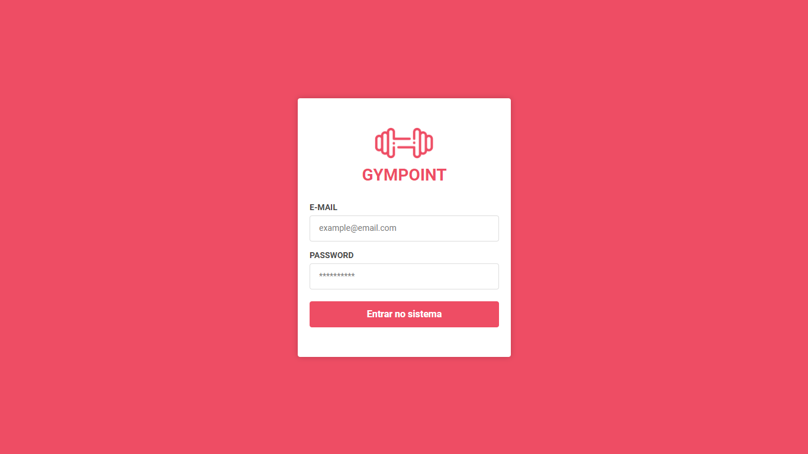

---
## Tela de Listagem de Alunos
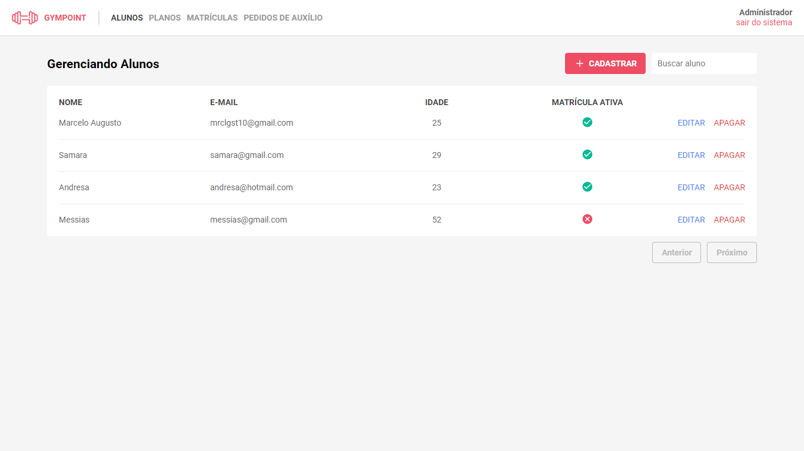

---
## Tela de Cadastro/Edição de Alunos
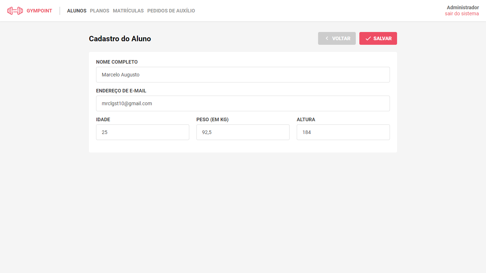

---
## Tela de Listagem de Matrículas
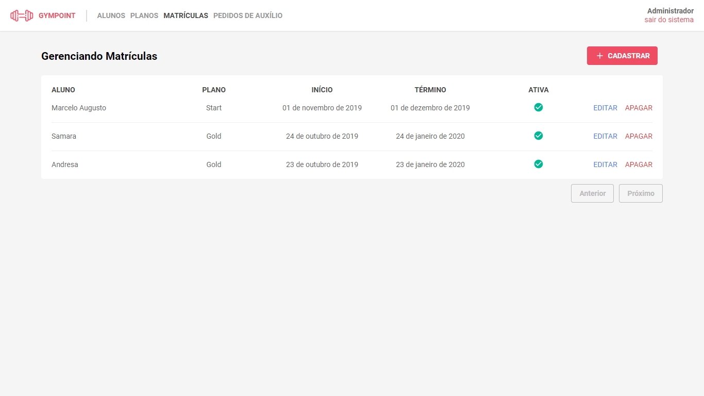

---
## Tela de Listagem de Planos
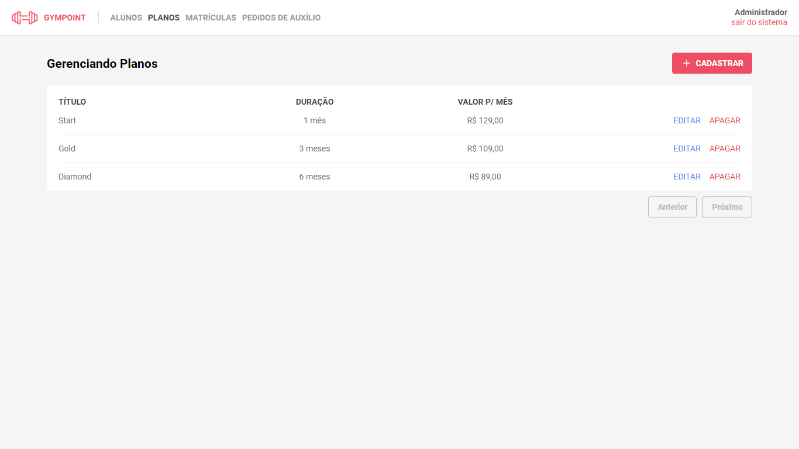

---
## Tela de Cadastro/Edição de Planos
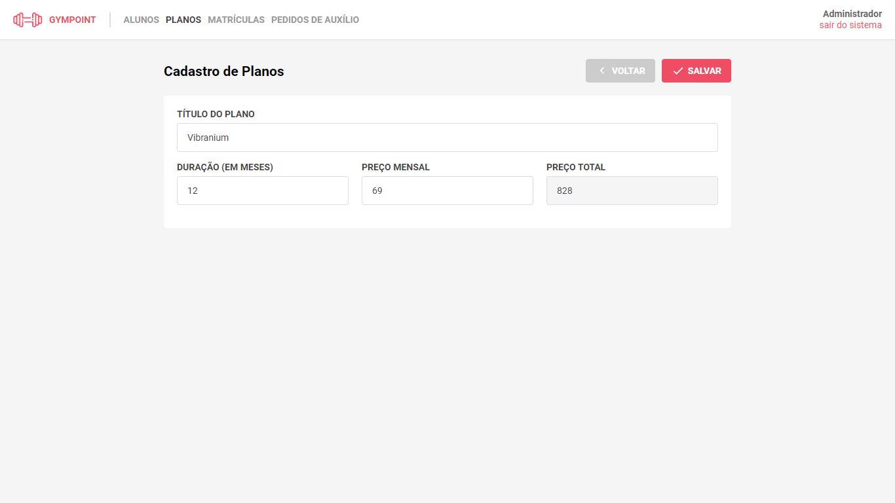

---
## Tela de Listagem de Pedidos de Auxílio
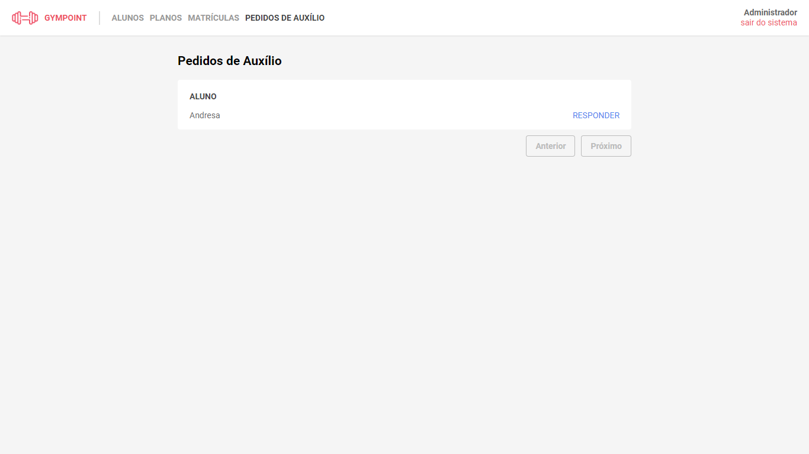

# Previews - *Mobile*

## Tela de Login (Aluno/Mobile)
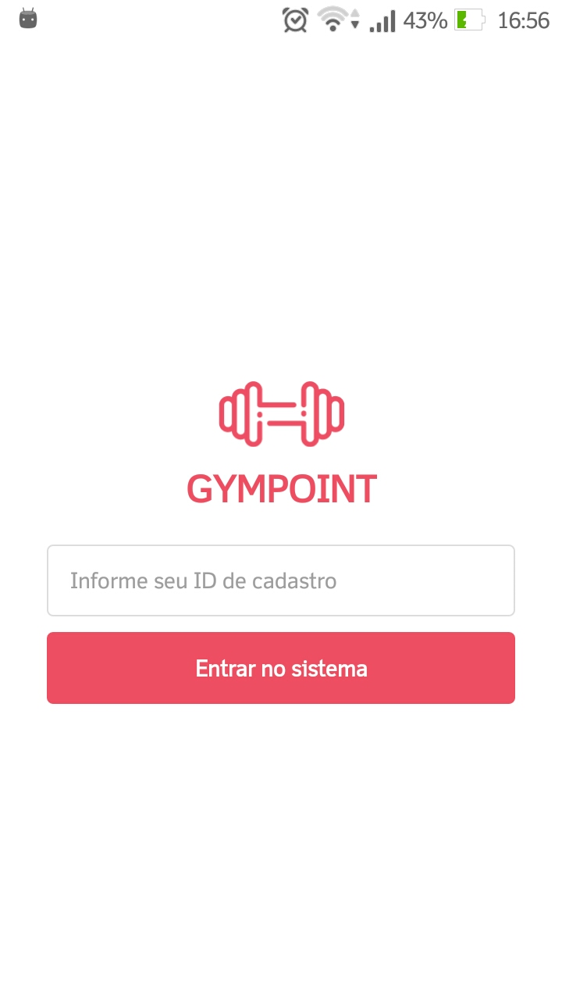

## Tela de Listagem de Check-ins (Aluno/Mobile)
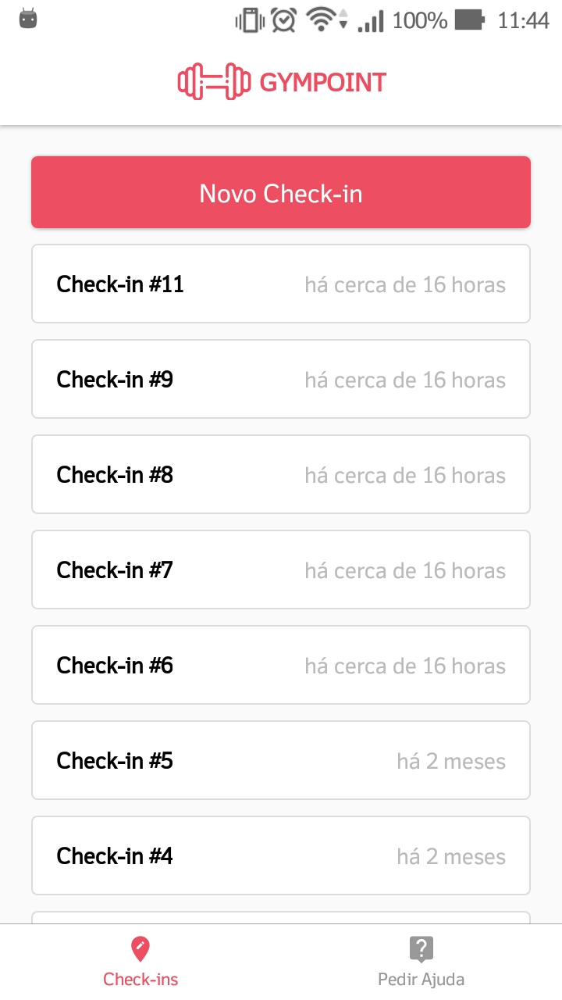

## Tela de Listagem de Pedidos de Auxílio (Aluno/Mobile)
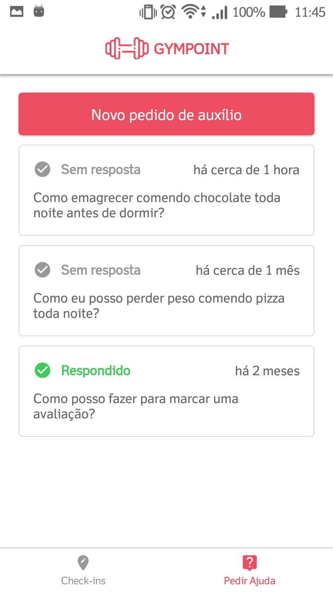

## Tela de Visualização do Pedido de Auxílio (Aluno/Mobile)
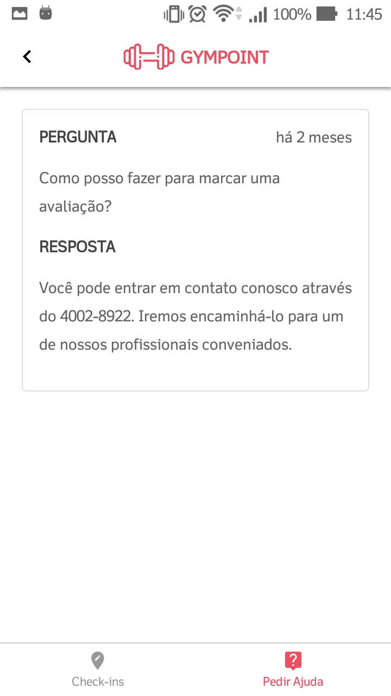

## Tela de Criação do Pedido de Auxílio (Aluno/Mobile)
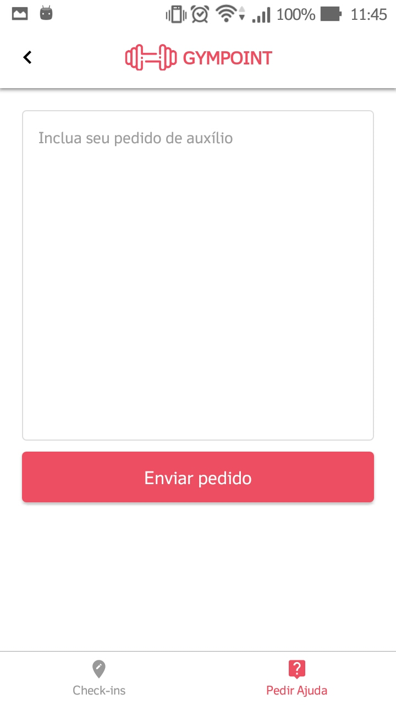
